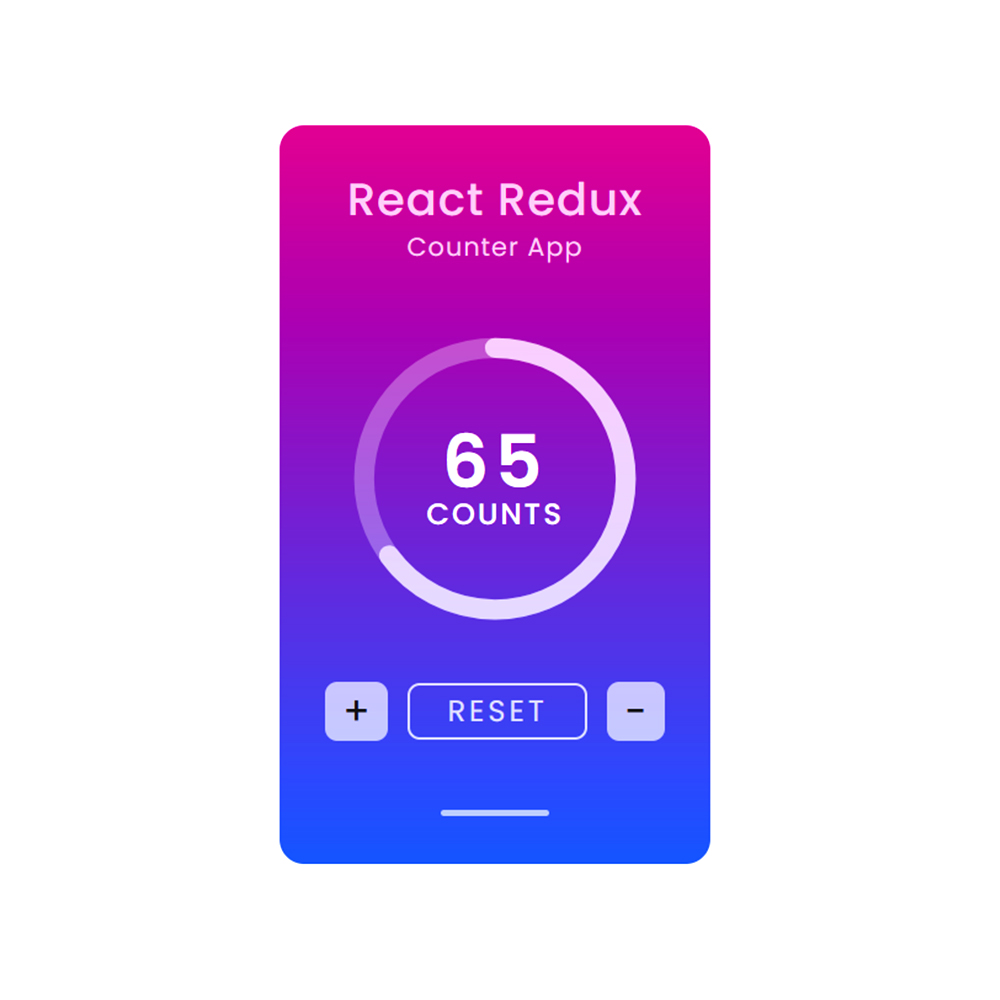

# React Couter App

The React Redux counter app is a simple web application built using React and Redux, two popular JavaScript libraries for managing state in front-end applications.

The main purpose of this app is to demonstrate the basic concepts of Redux and how it can be integrated with a React application to manage and update state in a predictable and centralized manner.

## Requirements

- Basic HTML, CSS & Javascript knowledge.
- Basic React JS, React Redux knowledge.

## How to Install & Run

To run the application, follow these steps:

1. Clone the repository or download it as a ZIP file.
2. In a terminal, navigate to the folder where the application is located.
3. Run the **npm install** command to install all the necessary dependencies.

```shell
npm install
```

4. Run the **npm run dev** command to start the application in development mode.

```shell
npm run dev
```

5. Open your browser and navigate to **http://localhost:5173** to use the application.

```shell
http://localhost:5173
```

## Application Features

The counter can be incremented or decremented by clicking on corresponding buttons. Each click triggers an action that updates the counter's value in the Redux store.

- Managing counter state.
- Increment counter value.
- Decrement counter value.
- Reser counter value.
- Store Counter value in localstorage.

## Technologies Used

The React Redux counter app serves as a minimal yet illustrative example of how Redux can be utilized with React to manage state effectively in larger and more complex applications. It showcases the unidirectional data flow of Redux, where state changes are handled through actions and reducers, promoting a more maintainable and scalable codebase.

- React JS
- React Redux
- React Hooks

## Contribution

If you'd like to contribute to this project, feel free to submit a pull request. Before doing so, be sure to create a separate branch for your changes.

## Buy A Coffee

Like my works and want to support me?

<a href="https://www.buymeacoffee.com/hossainpalin" target="_blank"></a>

## Screenshots



## Live demo

Live previews are the best way for a better understanding of the application's user interface.

[Click here...](https://hossainpalin.github.io/React-Redux-Counter-App/)
